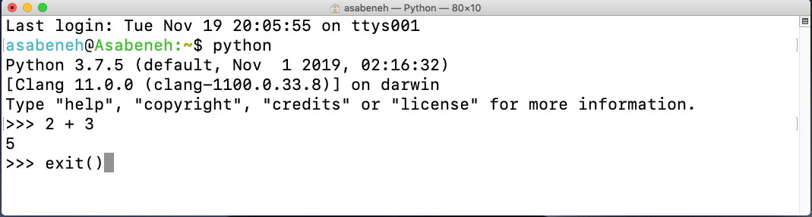
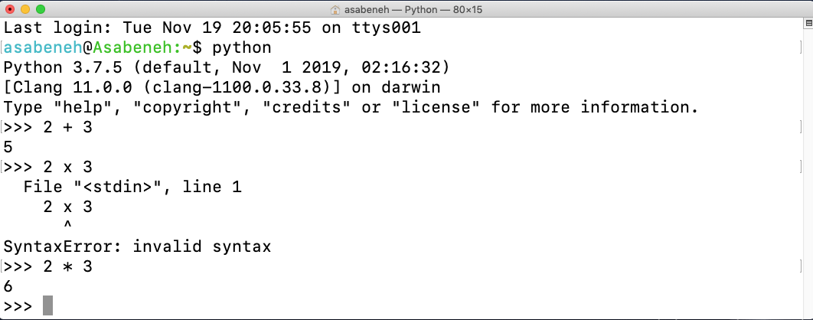
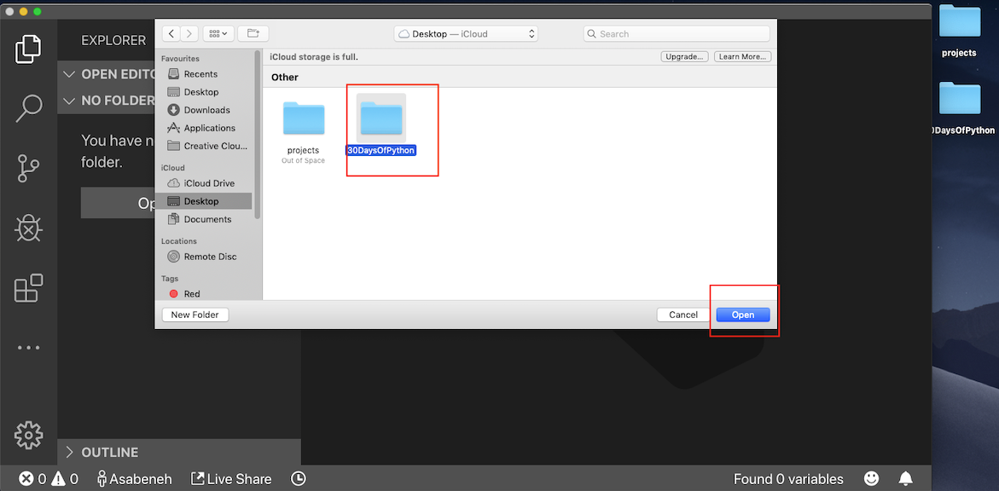
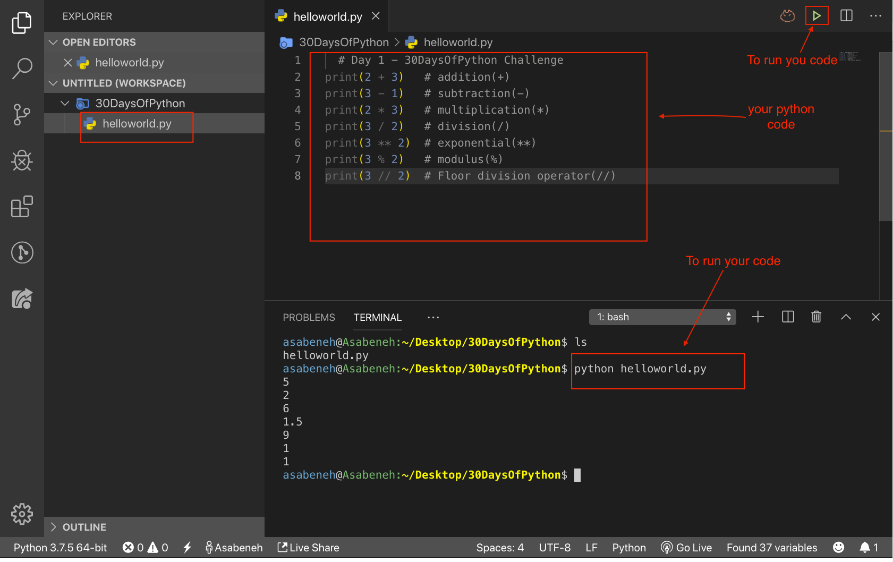

# 01 介绍

Python 是一种用于通用编程的高级编程语言。它是一种开源、解释型、面向对象的编程语言。Python 是由荷兰程序员Guido van Rossum创建的。Python编程语言的名称取自英国的一个喜剧系列，_Monty Python's Flying Circus_。第一个版本于1991年2月20日发布。

## 为什么选择Python？

它是一种非常接近人类语言的编程语言，因此易于学习和使用。
Python被各个行业和公司（包括Google）使用。它已经被用于开发Web应用程序、桌面应用程序、系统管理和机器学习库。Python在数据科学和机器学习社区中得到了高度的接受。我希望这足以说服您开始学习Python。Python正在吞噬这个世界，您可以在它吞噬您之前击败它。

## 环境设置

### 安装Python

要运行Python脚本，您需要安装Python。让我们[下载](https://www.python.org/) Python。
如果您是Windows用户，请点击红色圈中的按钮。

[](https://www.python.org/)

如果您是macOS用户。请点击红色圈中的按钮。

[](https://www.python.org/)

要检查Python是否已安装，请在您的设备终端上编写以下命令。

```shell
python --version
```


从终端中可以看到，我目前使用的是 _Python 3.7.5_ 版本。您的Python版本可能与我的不同，但应为3.6或更高版本。如果您能看到Python版本，那么恭喜您，Python已经安装在您的计算机上。继续下一节。

### Python Shell

Python是一种解释型脚本语言，因此不需要编译。这意味着它逐行执行代码。Python附带了一个名为 _Python Shell（Python交互式Shell）_ 的工具。它用于执行单个Python命令并获取结果。

Python Shell 等待来自用户的Python代码。当您输入代码时，它会解释代码并在下一行显示结果。
打开您的终端或命令提示符(cmd)并键入：

```shell
python
```


Python交互式shell已经打开，并等待您编写Python代码（Python脚本）。您将在此符号 >>> 旁边编写您的Python脚本，然后点击Enter。
让我们在Python脚本Shell上编写我们的第一个脚本。


干得好，您在Python交互式Shell上编写了您的第一个Python脚本。我们如何关闭Python交互式Shell？
要关闭Shell，在此符号 >> 旁边写入 **exit()** 命令并按Enter。



现在，您知道如何打开Python交互式Shell以及如何退出。

只要您编写Python能理解的脚本，Python就会给您返回结果，否则它会返回错误。让我们故意犯一个错误，看看Python会返回什么。


从返回的错误中，您可以看到Python非常聪明，它知道我们犯了错误，即 _Syntax Error: invalid syntax_，因为在Python中，将 x 用作乘法是语法错误，因为（x）在Python中不是有效的语法。代替 (**x**)，我们使用星号 (*) 进行乘法。返回的错误清楚地显示了要修复的内容。

从程序中识别并删除错误的过程称为 _调试_。让我们通过将 * 放在 **x** 的位置来调试它。



我们的错误已经被修复，代码运行并返回了我们期望的结果。作为程序员，您将每天看到这种类型的错误。了解如何调试是很好的。要善于调试，您应该了解您面临的错误类型。您可能会遇到的一些Python错误包括 _SyntaxError_、_IndexError_、_NameError_、_ModuleNotFoundError_、_KeyError_、_ImportError_、_AttributeError_、_TypeError_、_ValueError_、_ZeroDivisionError_ 等。我们将在后续部分更详细地了解不同的Python **错误类型**。

让我们继续练习如何使用Python交互式Shell。前往您的终端或命令提示符并键入单词 **python**。


Python交互式Shell已打开。在进入下一节之前，让我们在Python交互式Shell上进行更多练习。通过在Shell上写 _exit()_ 来关闭已打开的Shell，然后再次打开它，让我们练习如何在Python Shell上编写文本。


### 安装Visual Studio Code

Python交互式Shell适用于尝试和测试小型脚本代码，但不适用于大型项目。在实际工作环境中，开发人员使用不同的代码编辑器来编写代码。在这30天的Python编程挑战中，我们将使用Visual Studio Code。Visual Studio Code是一个非常流行的开源文本编辑器。我是vscode的粉丝，我建议[下载](https://code.visualstudio.com/)Visual Studio Code，但如果您更喜欢其他编辑器，请随意使用您拥有的编辑器。

[](https://code.visualstudio.com/)

如果您已安装Visual Studio Code，让我们看看如何使用它。

#### 如何使用Visual Studio Code

通过双击Visual Studio图标打开Visual Studio Code。当您打开它时，您将获得这种类型的界面。尝试与标记的图标进行交互。


在桌面上创建一个名为30DaysOfPython的文件夹。然后使用Visual Studio Code打开它。




打开后，您将看到创建30DaysOfPython项目目录内文件和文件夹的快捷方式。如下图所示，我已创建了第一个文件，helloworld.py。您可以做同样的事情。


在长时间编码之后，您想要关闭代码编辑器，对吗？这是如何关闭已打开项目的方法。


恭喜，您已经完成了设置开发环境的工作。让我们开始编码。

## 基本Python

### Python语法

Python脚本可以在Python交互式shell或代码编辑器中编写。Python文件的扩展名是.py。

### Python缩进

缩进是文本中的空白。在许多语言中，缩进用于增加代码的可读性，但是Python使用缩进来创建代码块。在其他编程语言中，大括号用于创建代码块，而不是缩进。编写Python代码时的常见错误之一是错误的缩进。


### 注释

注释对于使代码更具可读性并在我们的代码中留下备注非常重要。Python不运行我们代码中的注释部分。
在Python中，以井号(#)开头的任何文本都是注释。

**示例：单行注释**

```shell
    # 这是第一个注释
    # 这是第二个注释
    # Python正在吞噬世界
```

**示例：多行注释**

如果多行注释没有分配给变量，可以使用三重引号。

```shell
"""这是多行注释
多行注释占据多行。
Python正在吞噬世界
"""
```

### 数据类型

在Python中有多种数据类型。让我们从最常见的数据类型开始。其他部分将详细介绍不同的数据类型。目前，让我们只浏览不同的数据类型并熟悉它们。您现在不必完全了解它们。

#### 数字

- 整数：整数（负数、零和正数）
  示例：
  ... -3, -2, -1, 0, 1, 2, 3 ...
- 浮点数：十进制数
  示例：
  ... -3.5, -2.25, -1.0, 0.0, 1.1, 2.2, 3.5 ...
- 复数
  示例：
  1 + j, 2 + 4j

#### 字符串

在单引号或双引号下的一个或多个字符的集合。如果一个字符串超过一句，则使用三引号。

**示例：**

```py
'Asabeneh'
'Finland'
'Python'
'I love teaching'
'I hope you are enjoying the first day of 30DaysOfPython Challenge'
```

>在Python中，如果一个字符串包含多个句子，使用三引号（'''或"""）表示一个多行字符串文本块，也称为多行字符串字面值。这样的字符串可以跨越多行，包括换行符，而不需要使用转义字符或多个单行字符串来表示。
>
>例如：
>
>```python
>multiline_string = '''
>这是一个多行字符串。
>它可以包含多个句子和换行符。
>'''
>```
>
>或者使用双引号：
>
>```python
>multiline_string = """
>这也是一个多行字符串。
>使用双引号也可以创建多行字符串。
>"""
>```
>
>多行字符串通常用于文档字符串（docstrings）、长文本、SQL查询、HTML代码等需要跨越多行的情况。它们提供了一种方便的方式来包含大块文本而不需要在每行都添加换行符。

#### 布尔值

布尔数据类型要么是True，要么是False。T和F应始终大写。

**示例：**

```python
True  #  灯亮了吗？如果亮了，值为True
False # 灯亮了吗？如果熄灭了，值为False
```

#### 列表

Python列表是一个有序的集合，允许存储不同数据类型的项目。列表类似于JavaScript中的数组。

**示例：**

```py
[0, 1, 2, 3, 4, 5]  # 全部是相同数据类型 - 数字列表
['Banana', 'Orange', 'Mango', 'Avocado'] # 全部是相同数据类型 - 字符串列表（水果）
['Finland','Estonia', 'Sweden','Norway'] # 全部是相同数据类型 - 字符串列表（国家）
['Banana', 10, False, 9.81] # 列表中的不同数据类型 - 字符串、整数、布尔值和浮点数
```

#### 字典

Python字典对象是一个无序的数据集合，采用键值对格式。

**示例：**

```py
{
'first_name':'Asabeneh',
'last_name':'Yetayeh',
'country':'Finland', 
'age':250, 
'is_married':True,
'skills':['JS', 'React', 'Node', 'Python']
}
```

#### 元组

元组是一个有序的集合，与列表类似，但一旦创建，元组就无法修改。它们是不可变的。

**示例：**

```py
('Asabeneh', 'Pawel', 'Brook', 'Abraham', 'Lidiya') # 姓名
```

```py
('Earth', 'Jupiter', 'Neptune', 'Mars', 'Venus', 'Saturn', 'Uranus', 'Mercury') # 行星
```

#### 集合

集合是一种类似于列表和元组的数据类型。与列表和元组不同，集合不是有序的项目集合。就像在数学中一样，Python中的集合只存储唯一的项目。

在后

续部分中，我们将详细讨论每种Python数据类型。

**示例：**

```py
{2, 4, 3, 5}
{3.14, 9.81, 2.7} # 集合中的顺序不重要
```

### 检查数据类型

要检查某个数据/变量的数据类型，我们使用 **type** 函数。在下面的终端中，您将看到不同的Python数据类型：


### Python文件

首先打开您的项目文件夹，30DaysOfPython。如果您没有这个文件夹，请创建一个名为30DaysOfPython的文件夹。在此文件夹内创建一个名为helloworld.py的文件。现在，让我们在Visual Studio Code上进行Python交互式shell上做的事情。

Python交互式shell在不使用 **print** 的情况下进行打印，但是在Visual Studio Code上，为了查看我们的结果，我们应该使用内置函数 _print()_。 _print()_ 内置函数接受一个或多个参数，如下所示： _print('arument1', 'argument2', 'argument3')_。请查看下面的示例。

**示例：**

文件名为helloworld.py

```py
# 第1天 - 30天的Python挑战

print(2 + 3)             # 加法(+)
print(3 - 1)             # 减法(-)
print(2 * 3)             # 乘法(*)
print(3 / 2)             # 除法(/)
print(3 ** 2)            # 指数(**)
print(3 % 2)             # 模数(%)
print(3 // 2)            # 地板除法运算符(//)

# 检查数据类型
print(type(10))          # 整数
print(type(3.14))        # 浮点数
print(type(1 + 3j))      # 复数
print(type('Asabeneh'))  # 字符串
print(type([1, 2, 3]))   # 列表
print(type({'name':'Asabeneh'})) # 字典
print(type({9.8, 3.14, 2.7}))    # 集合
print(type((9.8, 3.14, 2.7)))    # 元组
```

要运行Python文件，请查看下面的图像。您可以通过在Visual Studio Code上运行绿色按钮，或在终端中键入 _python helloworld.py_ 来运行Python文件。



🌕 您很棒。您刚刚完成了第1天的挑战，并正朝着伟大的方向前进。现在为您的大脑和肌肉做一些练习。

## 💻 练习

### 练习：Level 1

1. 检查您正在使用的Python版本。
2. 打开Python交互式shell，并执行以下操作。操作数为3和4。
   - 加法(+)
   - 减法(-)
   - 乘法(\*)
   - 模数(%)
   - 除法(/)
   - 指数(\*\*)
   - 地板除法运算符(//)
3. 在Python交互式shell上编写字符串。字符串如下：
   - 您的名字
   - 您的姓氏
   - 您的国家
   - 我喜欢教学
   - 我希望您在30DaysOfPython挑战的第一天过得愉快
4. 检查以下数据的数据类型：
   - 10
   - 9.8
   - 3.14
   - 4 - 4j
   - ['Asabeneh', 'Python', '芬兰']
   - 您的名字
   - 您的姓氏
   - 您的国家

### 练习：Level 2

1. 在30DaysOfPython文件夹内创建一个名为day_1的文件夹。在day_1文件夹内，创建一个名为helloworld.py的Python文件，并重复问题1、2、3和4。请记住在Python文件上工作时使用 _print()_。导航到您保存文件的目录，并运行它。

### 练习：Level 3

1. 为不同的Python数据类型编写示例，如数字（整数、浮点数、复数）、字符串、布尔值、列表、元组、集合和字典。
2. 找到(2, 3)和(10, 8)之间的[欧几里得距离](https://upimg.baike.so.com/doc/2949437-3111768.html)。
