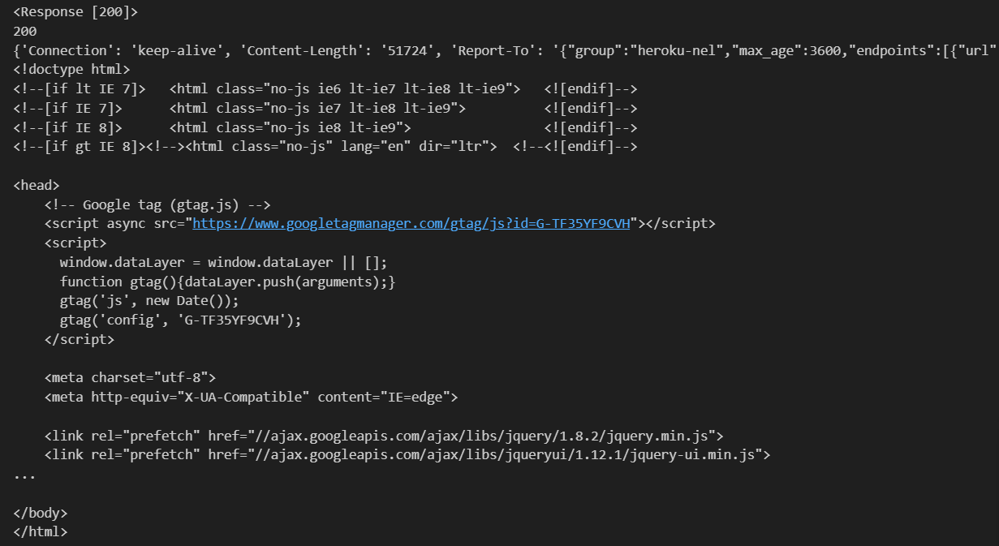

# 20 包管理器-pip

## 包管理器-pip

### 什么是 PIP？

PIP 代表首选安装程序。我们使用 _pip_ 来安装不同的 Python 包。
包是一个可以包含一个或多个模块或其他包的 Python 模块。我们可以安装到我们的应用程序中的一个或多个模块就是一个包。
在编程中，我们不必编写每个实用程序，而是安装包并将其导入到我们的应用程序中。

### 安装 PIP

如果您尚未安装 pip，请让我们现在安装它。转到您的终端或命令提示符，然后复制并粘贴以下内容：

```sh
pip install pip
```

通过输入以下命令检查是否安装了 pip：

```sh
pip --version
```

```
pip 21.1.3 from /usr/local/lib/python3.7/site-packages/pip (python 3.9.6)
```

如您所见，我使用的是 pip 版本 21.1.3，如果您看到稍微低于或高于这个数字的某个数字，那就表示您已经安装了 pip。

让我们检查 Python 社区中用于不同目的的一些包。只是让您知道，有许多可用于不同应用程序的包。

### 使用 pip 安装包

让我们尝试安装 _numpy_，也叫做数值 Python。这是机器学习和数据科学社区中最流行的包之一。

- NumPy 是用于科学计算的基础包。它包含了：
  - 强大的 N 维数组对象
  - 复杂的（广播broadcasting）函数
  - 用于集成 C/C++ 和 Fortran 代码的工具
  - 有用的线性代数、傅里叶变换和随机数功能

```sh
pip install numpy
```

让我们开始使用 numpy。打开您的 Python 交互式 shell，输入 python，然后按照以下方式导入 numpy：

```py
$ python
Python 3.8.16 (default, Mar  2 2023, 03:18:16) [MSC v.1916 64 bit (AMD64)] :: Anaconda, Inc. on win32
Type "help", "copyright", "credits" or "license" for more information.
>>> import numpy
>>> numpy.version.version
'1.20.1'
>>> lst = [1, 2, 3,4, 5]
>>> np_arr = numpy.array(lst)
>>> np_arr
array([1, 2, 3, 4, 5])
>>> len(np_arr)
5
>>> np_arr * 2
array([ 2,  4,  6,  8, 10])
>>> np_arr  + 2
array([3, 4, 5, 6, 7])
>>>
```

Pandas 是一个开源的 BSD 许可的库，为 Python 编程语言提供高性能、易于使用的数据结构和数据分析工具。让我们安装 numpy 的大兄弟 _pandas_：

```sh
pip install pandas
```

```py
$ python
Python 3.8.16 (default, Mar  2 2023, 03:18:16) [MSC v.1916 64 bit (AMD64)] :: Anaconda, Inc. on win32
Type "help", "copyright", "credits" or "license" for more information.
>>> import pandas
```

此部分不涉及 numpy 或 pandas，我们只是在试图学习如何安装包以及如何导入它们。如果需要，我们将在其他部分讨论不同的包。

让我们导入一个 Web 浏览器模块，它可以帮助我们打开任何网站。我们不需要安装此模块，它已经默认与 Python 3 一起安装。例如，如果您想随时打开任意数量的网站，或者如果您想安排一些任务，可以使用此 _webbrowser_ 模块。

```py
import webbrowser # 用于打开网站的web浏览器模块

# url列表：python
url_lists = [
    'http://www.python.org',
    'https://github.com/YQisme',
    'https://github.com/EanYang7/Python-Full-Stack',
]

# 在其他选项卡中打开以上网站列表
for url in url_lists:
    webbrowser.open_new_tab(url)
```

### 卸载包

如果您不想保留已安装的包，可以使用以下命令将它们删除。

```sh
pip uninstall packagename
```

### 包列表

要查看计算机上已安装的包，可以使用 pip 后跟 list。

```sh
pip list
```

### 显示包信息

要显示有关包的信息

```sh
pip show packagename
```

```sh
$ pip show pandas
Name: pandas
Version: 1.2.3
Summary: Powerful data structures for data analysis, time series, and statistics
Home-page: http://pandas.pydata.org
Author: None
Author-email: None
License: BSD
Location: /usr/local/lib/python3.7/site-packages
Requires: python-dateutil, pytz, numpy
Required-by:
```

如果我们想要更多的细节，只需添加 --verbose

```sh
$ pip show --verbose pandas
Name: pandas
Version: 1.2.3
Summary: Powerful data structures for data analysis, time series, and statistics
Home-page: http://pandas.pydata.org
Author: None
Author-email: None
License: BSD
Location: /usr/local/lib/python3.7/site-packages
Requires: numpy, pytz, python-dateutil
Required-by:


Metadata-Version: 2.1
Installer: pip
Classifiers:
  Development Status :: 5 - Production/Stable
  Environment :: Console
  Operating System :: OS Independent
  Intended Audience :: Science/Research
  Programming Language :: Python
  Programming Language :: Python :: 3
  Programming Language :: Python :: 3.5
  Programming Language :: Python :: 3.6
  Programming Language :: Python :: 3.7
  Programming Language :: Python :: 3.8
  Programming Language :: Cython
  Topic :: Scientific/Engineering
Entry-points:
  [pandas_plotting_backends]
  matplotlib = pandas:plotting._matplotlib
```

### PIP 冻结Freeze

生成已安装的 Python 包以及它们的版本，输出适合在 requirements 文件中使用的格式。requirements.txt 文件是一个应包含 Python 项目中所有已安装的 Python 包的文件。

```sh
$ pip freeze
docutils==0.11
Jinja2==2.7.2
MarkupSafe==0.19
Pygments==1.6
Sphinx==1.2.2
```

pip freeze 给了我们使用的包、已安装的包及其版本。我们将它与 requirements.txt 文件一起使用进行部署。

### 从 URL 读取

到目前为止，您已经知道如何读取或写入位于本地计算机上的文件。有时，我们希望使用 URL 或 API 从网站读取数据。
API 代表应用程序编程接口。它是一种在服务器之间交换结构化数据的手段，主要是 JSON 数据。要打开网络连接，我们需要一个称为 _requests_ 的包 - 它允许打开网络连接并实现 CRUD（创建、读取、更新和删除）操作。在本节中，我们将仅涵盖 CRUD 的一部分，即读取或获取。

让我们安装 _requests_：

```py
pip install requests
```

我们将在 _requests_ 模块中看到 _get_、_status_code_、_headers_、_text_ 和 _json_ 方法：

  - _get()_：打开网络并从 URL 获取数据 - 它返回一个响应对象
  - _status_code_：在获取数据后，我们可以检查操作的状态（成功、错误等）
  - _headers_：检查头部类型
  - _text_：从获取的响应对象中提取文本 
  - _json_：提取 JSON 数据
    让我们从此网站读取一个 txt 文件，https://www.w3.org/TR/PNG/iso_8859-1.txt。

```py
import requests # 导入请求模块

url = 'https://www.python.org/' # 从网站获取文本

response = requests.get(url) # 打开网络并获取数据
print(response)
print(response.status_code) # 状态码，成功：200
print(response.headers)     # 头部信息
print(response.text) # 提供页面上的所有文本
```

 

- 让我们从 API 读取。API 代表 Application Program Interface。它是一种在服务器之间交换结构化数据的手段，主要是 JSON 数据。一个示例是：https://restcountries.eu/rest/v2/all。让我们使用 _requests_ 模块读取此 API。

```py
import requests
url = 'https://restcountries.com/v3.1/all'  # 国家API
response = requests.get(url)  # 打开网络并获取数据
print(response) # 响应对象
print(response.status_code)  # 状态码，成功:200
countries = response.json()
print(countries[:1])  # 我们只切片了第一个国家，去掉切片以查看所有国家
```

```sh
<Response [200]>
200
[
    {'name': {'common': 'Christmas Island', 'official': 'Territory of Christmas Island', 'nativeName': {'eng': {'official': 'Territory of Christmas Island', 'common': 'Christmas Island'
                }
            }
        }, 'tld': ['.cx'
        ], 'cca2': 'CX', 'ccn3': '162', 'cca3': 'CXR', 'independent': False, 'status': 'officially-assigned', 'unMember': False, 'currencies': {'AUD': {'name': 'Australian dollar', 'symbol': '$'
            }
        }, 'idd': {'root': '+6', 'suffixes': ['1'
            ]
        }, 'capital': ['Flying Fish Cove'
        ], 'altSpellings': ['CX', 'Territory of Christmas Island'
        ], 'region': 'Oceania', 'subregion': 'Australia and New Zealand', 'languages': {'eng': 'English'
        }, 'translations': {'ara': {'official': 'جزيرة كريسماس', 'common': 'جزيرة كريسماس'
            }, 'bre': {'official': 'Tiriad Enez Christmas', 'common': 'Enez Christmas'
            }, 'ces': {'official': 'Teritorium Vánočního ostrova', 'common': 'Vánoční ostrov'
            }, 'cym': {'official': 'Tiriogaeth yr Ynys y Nadolig', 'common': 'Ynys y Nadolig'
            }, 'deu': {'official': 'Gebiet der Weihnachtsinsel', 'common': 'Weihnachtsinsel'
            }, 'est': {'official': 'Jõulusaare ala', 'common': 'Jõulusaar'
            }, 'fin': {'official': 'Joulusaaren alue', 'common': 'Joulusaari'
            }, 'fra': {'official': "Territoire de l'île Christmas", 'common': 'Île Christmas'
            }, 'hrv': {'official': 'Teritorij Božićni otok', 'common': 'Božićni otok'
            }, 'hun': {'official': 'Karácsony-sziget', 'common': 'Karácsony-sziget'
            }, 'ita': {'official': 'Territorio di Christmas Island', 'common': 'Isola di Natale'
            }, 'jpn': {'official': 'クリスマス島の領土', 'common': 'クリスマス島'
            }, 'kor': {'official': '크리스마스 섬', 'common': '크리스마스 섬'
            }, 'nld': {'official': 'Grondgebied van Christmas Island', 'common': 'Christmaseiland'
            }, 'per': {'official': 'جزیرهٔ کریسمس', 'common': 'جزیرهٔ کریسمس'
            }, 'pol': {'official': 'Wyspa Bożego Narodzenia', 'common': 'Wyspa Bożego Narodzenia'
            }, 'por': {'official': 'Território da Ilha Christmas', 'common': 'Ilha do Natal'
            }, 'rus': {'official': 'Территория острова Рождества', 'common': 'Остров Рождества'
            }, 'slk': {'official': 'Teritórium Vianočného ostrova', 'common': 'Vianočnú ostrov'
            }, 'spa': {'official': 'Territorio de la Isla de Navidad', 'common': 'Isla de Navidad'
            }, 'srp': {'official': 'Божићно Острво', 'common': 'Божићно Острво'
            }, 'swe': {'official': 'Julön', 'common': 'Julön'
            }, 'tur': {'official': 'Christmas Adası', 'common': 'Christmas Adası'
            }, 'urd': {'official': 'ریاستِ جزیرہ کرسمس', 'common': 'جزیرہ کرسمس'
            }, 'zho': {'official': '圣诞岛', 'common': '圣诞岛'
            }
        }, 'latlng': [
            -10.5,
            105.66666666
        ], 'landlocked': False, 'area': 135.0, 'demonyms': {'eng': {'f': 'Christmas Islander', 'm': 'Christmas Islander'
            }
        }, 'flag': '🇨🇽', 'maps': {'googleMaps': 'https: //goo.gl/maps/ZC17hHsQZpShN5wk9', 'openStreetMaps': 'https://www.openstreetmap.org/relation/6365444'}, 'population': 2072, 'car': {'signs': ['AUS'], 'side': 'left'}, 'timezones': ['UTC+07:00'], 'continents': ['Asia'], 'flags': {'png': 'https://flagcdn.com/w320/cx.png', 'svg': 'https://flagcdn.com/cx.svg'}, 'coatOfArms': {'png': 'https://mainfacts.com/media/images/coats_of_arms/cx.png', 'svg': 'https://mainfacts.com/media/images/coats_of_arms/cx.svg'}, 'startOfWeek': 'monday', 'capitalInfo': {'latlng': [-10.42, 105.68]}, 'postalCode': {'format': '####', 'regex': '^(\\d{4})$'}}]
```

如果我们获取JSON数据，我们使用响应对象的 `json()` 方法。对于txt、html、xml和其他文件格式，我们可以使用 _text_。

### 创建一个包

我们根据某些标准将大量文件组织在不同的文件夹和子文件夹中，以便我们可以轻松地找到和管理它们。正如您所知，一个模块可以包含多个对象，如类、函数等。一个包可以包含一个或多个相关的模块。实际上，包是一个包含一个或多个模块文件的文件夹。让我们使用以下步骤创建一个名为mypackage的包：

在mypackage文件夹中创建一个空的`__init__.py`文件。
使用以下代码创建名为arithmetics.py和greet.py的模块：

```py
# mypackage/arithmetics.py
# arithmetics.py
def add_numbers(*args):
    total = 0
    for num in args:
        total += num
    return total


def subtract(a, b):
    return (a - b)


def multiple(a, b):
    return a * b


def division(a, b):
    return a / b


def remainder(a, b):
    return a % b


def power(a, b):
    return a ** b
```

```py
# mypackage/greet.py
# greet.py
def greet_person(firstname, lastname):
    return f'{firstname} {lastname}, welcome to 30DaysOfPython Challenge!'
```

您的包的文件夹结构应如下所示：

```sh
─ mypackage
    ├── __init__.py
    ├── arithmetic.py
    └── greet.py
```

现在让我们打开Python交互式 shell，并尝试我们创建的包：

```sh
$ python
Python 3.9.6 (default, Jun 28 2021, 15:26:21)
[Clang 11.0.0 (clang-1100.0.33.8)] on darwin
Type "help", "copyright", "credits" or "license" for more information.
>>> from mypackage import arithmetics
>>> arithmetics.add_numbers(1, 2, 3, 5)
11
>>> arithmetics.subtract(5, 3)
2
>>> arithmetics.multiple(5, 3)
15
>>> arithmetics.division(5, 3)
1.6666666666666667
>>> arithmetics.remainder(5, 3)
2
>>> arithmetics.power(5, 3)
125
>>> from mypackage import greet
>>> greet.greet_person('Asabeneh', 'Yetayeh')
'Asabeneh Yetayeh, welcome to 30DaysOfPython Challenge!'
>>>
```

正如您所见，我们的包完美运行。包文件夹包含一个名为`__init__.py`的特殊文件 - 它存储包的内容。如果我们将`__init__.py`放在包文件夹中，Python将开始将其识别为包。`__init__.py`将包的指定资源暴露给其他Python文件导入。空的`__init__.py`文件使得在导入包时所有函数都可用。`__init__.py`对于Python识别文件夹为包至关重要。

### 关于包的更多信息

- 数据库
    - SQLAlchemy或SQLObject - 面向对象的访问多个不同数据库系统
    - `pip install SQLAlchemy`
- Web开发
    - Django - 高级Web框架。
        - `pip install django`
    - Flask - 基于Werkzeug、Jinja 2的微框架（BSD许可证）
        - `pip install flask`
- HTML解析器
    - [Beautiful Soup](https://www.crummy.com/software/BeautifulSoup/bs4/doc/) - 为快速周转项目设计的HTML/XML解析器，将接受不良标记。
        - `pip install beautifulsoup4`
    - PyQuery - 在Python中实现jQuery；比BeautifulSoup更快，显然。
- XML处理
    - ElementTree - Element类型是一个简单但灵活的容器对象，设计用于在内存中存储分层数据结构，例如简化的XML信息集。--注意：Python 2.5及更高版本在标准库中有ElementTree。
- GUI
    - PyQt - 跨平台Qt框架的绑定。
    - TkInter - 传统的Python用户界面工具包。
- 数据分析、数据科学和机器学习
    - Numpy：Numpy（数值Python）被认为是Python中最流行的机器学习库之一。
    - Pandas：是Python中的数据分析、数据科学和机器学习库，提供了高级数据结构和各种分析工具。
    - SciPy：SciPy是面向应用开发人员和工程师的机器学习库。SciPy库包含了用于优化、线性代数、积分、图像处理和统计的模块。
    - Scikit-Learn：它是NumPy和SciPy。被认为是处理复杂数据的最佳库之一。
    - TensorFlow：是由Google构建的机器学习库。
    - Keras：被认为是Python中最酷的机器学习库之一。它提供了一个更容易表达神经网络的机制。Keras还提供了一些最佳的工具，用于编译模型、处理数据集、可视化图形等等。
- 网络：
    - requests：是一个包，我们可以使用它发送请求到服务器（GET、POST、DELETE、PUT）
        - `pip install requests`


## 练习：第20天

1. 读取此网址并查找前10个最常见的单词。romeo_and_juliet = 'http://www.gutenberg.org/files/1112/1112.txt'
2. 读取猫的API和cats_api = 'https://api.thecatapi.com/v1/breeds'，并找到：
   1. 猫的体重在公制单位中的最小值、最大值、平均值、中位数、标准差。
   2. 猫的寿命在年份中的最小值、最大值、平均值、中位数、标准差。
   3. 创建一个国家和猫种的频率表。
3. 读取[国家API](https://restcountries.eu/rest/v2/all)并查找：
   1. 十个最大的国家
   2. 十种最常用的语言
   3. 国家API中的语言总数
4. UCI是获取数据科学和机器学习数据集的最常见地点之一。读取UCL（https://archive.ics.uci.edu/ml/datasets.php）的内容。如果没有其他库，这将很困难，所以您可以尝试使用BeautifulSoup4。

