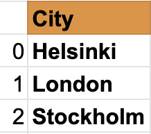
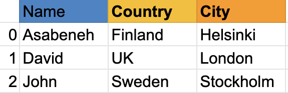

# 25 Pandas

Pandas是一个开源的、高性能的、易于使用的Python编程语言的数据结构和数据分析工具。
Pandas添加了与表格式数据一起使用的数据结构和工具，包括*Series*和*DataFrames*。
Pandas提供了数据操作工具：

- 重塑reshaping
- 合并merging
- 排序sorting
- 切片slicing
- 聚合aggregation

> 如果您使用Anaconda，无需安装Pandas。

### 安装Pandas

对于Mac：

```py
pip install conda
conda install pandas
```

对于Windows：

```py
pip install conda
pip install pandas
```

Pandas数据结构基于*Series*和*DataFrames*。

*Series*是一个*列*，而DataFrame是由一系列*Series*组成的*多维表格*。为了创建一个Pandas系列，我们应该使用NumPy创建一个一维数组或Python列表。
让我们看一个系列的示例：

Names Pandas Series

 

Countries Series

 

Cities Series



正如您所看到的，Pandas系列只是一列数据。如果我们想要有多列，我们使用数据帧。下面的示例显示了Pandas DataFrames。

让我们看一个Pandas数据帧的示例：



数据框是行和列的集合。看看下面的表格；它比上面的示例有更多的列：


接下来，我们将看看如何导入Pandas以及如何使用Pandas创建Series和DataFrames

### 导入Pandas

```python
import pandas as pd # 将Pandas导入为pd
import numpy as np # 将NumPy导入为np
```

### 创建带有默认索引的Pandas Series

```python
nums = [1, 2, 3, 4, 5]
s = pd.Series(nums)
print(s)
```

```sh
    0    1
    1    2
    2    3
    3    4
    4    5
    dtype: int64
```

### 创建带有自定义索引的Pandas Series

```python
nums = [1, 2, 3, 4, 5]
s = pd.Series(nums, index=[1, 2, 3, 4, 5])
print(s)
```

```sh
    1    1
    2    2
    3    3
    4    4
    5    5
    dtype: int64
```

```python
fruits = ['橙子','香蕉','芒果']
fruits = pd.Series(fruits, index=[1, 2, 3])
print(fruits)
```

```sh
    1    橙子
    2    香蕉
    3    芒果
    dtype: object
```

### 从字典创建Pandas Series

```python
dct = {'name':'Asabeneh','country':'Finland','city':'Helsinki'}
```

```python
s = pd.Series(dct)
print(s)
```

```sh
    name       Asabeneh
    country     Finland
    city       Helsinki
    dtype: object
```

### 创建一个常数Pandas Series

```python
s = pd.Series(10, index = [1, 2, 3])
print(s)
```

```sh
    1    10
    2    10
    3    10
    dtype: int64
```

### 使用Linspace创建Pandas Series

```python
s = pd.Series(np.linspace(5, 20, 10)) # linspace(starting, end, items)
print(s)
```

```sh
    0     5.000000
    1     6.666667
    2     8.333333
    3    10.000000
    4    11.666667
    5    13.333333
    6    15.000000
    7    16.666667
    8    18.333333
    9    20.000000
    dtype: float64
```

## 数据帧

Pandas数据帧可以以不同的方式创建。

### 从列表列表创建数据帧

```python
data = [
    ['Asabeneh', '芬兰', '赫尔辛基'], 
    ['David', '英国', '伦敦'],
    ['John', '瑞典', '斯德哥尔摩']
]
df = pd.DataFrame(data, columns=['姓名','国家','城市'])
print(df)
```

<table border="1" class="dataframe">
  <thead>
    <tr style="text-align: right;">
      <th></th>
      <th>姓名</th>
      <th>国家</th>
      <th>城市</th>
    </tr>
  </thead>
  <tbody>
    <tr>
      <td>0</td>
      <td>Asabeneh</td>
      <td>芬兰</td>
      <td>赫尔辛基</td>
    </tr>
    <tr>
      <td>1</td>
      <td>David</td>
      <td>英国</td>
      <td>伦敦</td>
    </tr>
    <tr>
      <td>2</td>
      <td>John</td>
      <td>瑞典</td>
      <td>斯德哥尔摩</td>
    </tr>
  </tbody>
</table>


### 使用字典创建数据帧

```python
data = {'姓名': ['Asabeneh', 'David', 'John'], '国家':[
    '芬兰', '英国', '瑞典'], '城市': ['赫尔辛基', '伦敦', '斯德哥尔摩']}
df = pd.DataFrame(data)
print(df)
```

<table border="1" class="dataframe">
  <thead>
    <tr style="text-align: right;">
      <th></th>
      <th>姓名</th>
      <th>国家</th>
      <th>城市</th>
    </tr>
  </thead>
  <tbody>
    <tr>
      <td>0</td>
      <td>Asabeneh</td>
      <td>芬兰</td>
      <td>赫尔辛基</td>
    </tr>
    <tr>
      <td>1</td>
      <td>David</td>
      <td>英国</td>
      <td>伦敦</td>
    </tr>
    <tr>
      <td>2</td>
      <td>John</td>
      <td>瑞典</td>
      <td>斯德哥尔摩</td>
    </tr>
  </tbody>
</table>


### 从字典列表创建数据帧

```python
data = [
    {'姓名': 'Asabeneh', '国家': '芬兰', '城市': '赫尔辛基'},
    {'姓名': 'David', '国家': '英国', '城市': '伦敦'},
    {'姓名': 'John', '国家': '瑞典', '城市': '斯德哥尔摩'}]
df = pd.DataFrame(data)
print(df)
```

<table border="1" class="dataframe">
  <thead>
    <tr style="text-align: right;">
      <th></th>
      <th>姓名</th>
      <th>国家</th>
      <th>城市</th>
    </tr>
  </thead>
  <tbody>
    <tr>
      <td>0</td>
      <td>Asabeneh</td>
      <td>芬兰</td>
      <td>赫尔辛基</td>
    </tr>
    <tr>
      <td>1</td>
      <td>David</td>
      <td>英国</td>
      <td>伦敦</td>
    </tr>
    <tr>
      <td>2</td>
      <td>John</td>
      <td>瑞典</td>
      <td>斯德哥尔摩</td>
    </tr>
  </tbody>
</table>


## 使用Pandas读取CSV文件

要下载CSV文件，在这个示例中，控制台/命令行足够了：

```sh
curl -O https://raw.githubusercontent.com/Asabeneh/30-Days-Of-Python/master/data/weight-height.csv
```

将下载的文件放入您的工作目录。

```python
import pandas as pd

df = pd.read_csv('weight-height.csv')
print(df)
```

### 数据探索

让我们只读取前5行，使用`head()`方法

```python
print(df.head()) # 通过传递参数给head()方法，可以获得五行以上的数据
```


<table border="1" class="dataframe">
  <thead>
    <tr style="text-align: right;">
      <th></th>
      <th>性别</th>
      <th>身高</th>
      <th>体重</th>
    </tr>
  </thead>
  <tbody>
    <tr>
      <td>0</td>
      <td>男性</td>
      <td>73.847017</td>
      <td>241.893563</td>
    </tr>
    <tr>
      <td>1</td>
      <td>男性</td>
      <td>68.781904</td>
      <td>162.310473</td>
    </tr>
    <tr>
      <td>2</td>
      <td>男性</td>
      <td>74.110105</td>
      <td>212.740856</td>
    </tr>
    <tr>
      <td>3</td>
      <td>男性</td>
      <td>71.730978</td>
      <td>220.042470</td>
    </tr>
    <tr>
      <td>4</td>
      <td>男性</td>
      <td>69.881796</td>
      <td>206.349801</td>
    </tr>
  </tbody>
</table>
让我们也使用`tail()`方法来探索数据帧的最后记录。

```python
print(df.tail()) # 通过传递参数给tail方法，可以获得五行以上的数据
```

<table border="1" class="dataframe">
  <thead>
    <tr style="text-align: right;">
      <th></th>
      <th>性别</th>
      <th>身高</th>
      <th>体重</th>
    </tr>
  </thead>
  <tbody>
    <tr>
      <td>9995</td>
      <td>女性</td>
      <td>66.172652</td>
      <td>136.777454</td>
    </tr>
    <tr>
      <td>9996</td>
      <td>女性</td>
      <td>67.067155</td>
      <td>170.867906</td>
    </tr>
    <tr>
      <td>9997</td>
      <td>女性</td>
      <td>63.867992</td>
      <td>128.475319</td>
    </tr>
    <tr>
      <td>9998</td>
      <td>女性</td>
      <td>69.034243</td>
      <td>163.852461</td>
    </tr>
    <tr>
      <td>9999</td>
      <td>女性</td>
      <td>61.944246</td>
      <td>113.649103</td>
    </tr>
  </tbody>
</table>

如您所见，CSV文件有三行：性别、身高和体重。如果DataFrame有很多行，将很难了解所有的列。因此，我们应该使用一种方法来了解列。我们不知道行的数量。让我们使用`shape`方法。

```python
print(df.shape) # 可以看到有10000行和三列
```

    (10000, 3)

让我们使用`columns`获取所有的列。

```python
print(df.columns)
```

    Index(['性别', '身高', '体重'], dtype='object')

现在，让我们使用列键来获取特定的列。

```python
heights = df['身高'] # 现在这是一个系列
```

```python
print(heights)
```

```sh
    0       73.847017
    1       68.781904
    2       74.110105
    3       71.730978
    4       69.881796
              ...    
    9995    66.172652
    9996    67.067155
    9997    63.867992
    9998    69.034243
    9999    61.944246
    Name: 身高, Length: 10000, dtype: float64
```

```python
weights = df['体重'] # 现在这是一个系列
```

```python
print(weights)
```

```sh
    0       241.893563
    1       162.310473
    2       212.740856
    3       220.042470
    4       206.349801
               ...    
    9995    136.777454
    9996    170.867906
    9997    128.475319
    9998    163.852461
    9999    113.649103
    Name: 体重, Length: 10000, dtype: float64
```

```python
print(len(heights) == len(weights))
```

    True

`describe()`方法提供了有关数据集的描述性统计值。

```python
print(heights.describe()) # 给出身高数据的统计信息
```

```sh
    count    10000.000000
    mean        66.367560
    std          3.847528
    min         54.263133
    25%         63.505620
    50%         66.318070
    75%         69.174262
    max         78.998742
    Name: 身高, dtype: float64
```

```python
print(weights.describe()) # 给出体重数据的统计信息
```

```sh
    count    10000.000000
    mean       161.440357
    std         32.108439
    min         64.700127
    25%        135.818051
    50%        161.212928
    75%        187.169525
    max        269.989699
    Name: 体重, dtype: float64
```

```python
print(df.describe())  # 描述也可以从DataFrame中提供统计信息
```

<table border="1" class="dataframe">
  <thead>
    <tr style="text-align: right;">
      <th></th>
      <th>身高</th>
      <th>体重</th>
    </tr>
  </thead>
  <tbody>
    <tr>
      <td>count</td>
      <td>10000.000000</td>
      <td>10000.000000</td>
    </tr>
    <tr>
      <td>mean</td>
      <td>66.367560</td>
      <td>161.440357</td>
    </tr>
    <tr>
      <td>std</td>
      <td>3.847528</td>
      <td>32.108439</td>
    </tr>
    <tr>
      <td>min</td>
      <td>54.263133</td>
      <td>64.700127</td>
    </tr>
    <tr>
      <td>25%</td>
      <td>63.505620</td>
      <td>135.818051</td>
    </tr>
    <tr>
      <td>50%</td>
      <td>66.318070</td>
      <td>161.212928</td>
    </tr>
    <tr>
      <td>75%</td>
      <td>69.174262</td>
      <td>187.169525</td>
    </tr>
    <tr>
      <td>max</td>
      <td>78.998742</td>
      <td>269.989699</td>
    </tr>
  </tbody>
</table>
与`describe()`类似，`info()`方法也提供有关数据集的信息。

修改DataFrame：

* 我们可以创建一个新的DataFrame
* 我们可以创建一个新的列并将其添加到DataFrame中
* 我们可以从DataFrame中删除现有列
* 我们可以修改DataFrame中的现有列
* 我们可以更改DataFrame中列值的数据类型

## 创建DataFrame

首先，像往常一样，我们导入必要的包。现在，让我们导入pandas和numpy，它们是最好的朋友。

```python
import pandas as pd
import numpy as np
data = [
    {"姓名": "Asabeneh", "国家":"芬兰","城市":"赫尔辛基"},
    {"姓名": "David", "国家":"英国","城市":"伦敦"},
    {"姓名": "John", "国家":"瑞典","城市":"斯德哥尔摩"}]
df = pd.DataFrame(data)
print(df)
```

<table border="1" class="dataframe">
  <thead>
    <tr style="text-align: right;">
      <th></th>
      <th>姓名</th>
      <th>国家</th>
      <th>城市</th>
    </tr>
  </thead>
  <tbody>
    <tr>
      <td>0</td>
      <td>Asabeneh</td>
      <td>芬兰</td>
      <td>赫尔辛基</td>
    </tr>
    <tr>
      <td>1</td>
      <td>David</td>
      <td>英国</td>
      <td>伦敦</td>
    </tr>
    <tr>
      <td>2</td>
      <td>John</td>
      <td>瑞典</td>
      <td>斯德哥尔摩</td>
    </tr>
  </tbody>
</table>


向DataFrame中添加列就像向字典中添加键一样。

首先，让我们使用前面的示例创建一个DataFrame。在创建DataFrame后，我们将开始修改列和列值。

### 添加新列

让我们在DataFrame中添加一个体重列

```python
weights = [74, 78, 69]
df['体重'] = weights
df
```

<table border="1" class="dataframe">
  <thead>
    <tr style="text-align: right;">
      <th></th>
      <th>姓名</th>
      <th>国家</th>
      <th>城市</th>
      <th>体重</th>
    </tr>
  </thead>
  <tbody>
    <tr>
      <td>0</td>
      <td>Asabeneh</td>
      <td>芬兰</td>
      <td>赫尔辛基</td>
      <td>74</td>
    </tr>
    <tr>
      <td>1</td>
      <td>David</td>
      <td>英国</td>
      <td>伦敦</td>
      <td>78</td>
    </tr>
    <tr>
      <td>2</td>
      <td>John</td>
      <td>瑞典</td>
      <td>斯德哥尔摩</td>
      <td>69</td>
    </tr>
  </tbody>
</table>


让我们也在DataFrame中添加一个身高列

```python
heights = [173, 175, 169]
df['身高'] = heights
print(df)
```

<table border="1" class="dataframe">
  <thead>
    <tr style="text-align: right;">
      <th></th>
      <th>姓名</th>
      <th>国家</th>
      <th>城市</th>
      <th>体重</th>
      <th>身高</th>
    </tr>
  </thead>
  <tbody>
    <tr>
      <td>0</td>
      <td>Asabeneh</td>
      <td>芬兰</td>
      <td>赫尔辛基</td>
      <td>74</td>
      <td>173</td>
    </tr>
    <tr>
      <td>1</td>
      <td>David</td>
      <td>英国</td>
      <td>伦敦</td>
      <td>78</td>
      <td>175</td>
    </tr>
    <tr>
      <td>2</td>
      <td>John</td>
      <td>瑞典</td>
      <td>斯德哥尔摩</td>
      <td>69</td>
      <td>169</td>
    </tr>
  </tbody>
</table>


正如您在上面的DataFrame中看到的，我们添加了新列Weight和Height。让我们添加一个名为BMI（身体质量指数）的额外列，通过计算他们的BMI来计算他们的BMI，使用他们的质量和身高。BMI是质量除以身高的平方（以米为单位） - 体重/身高 *身高。

如您所见，身高以厘米为单位，因此我们应该将其更改为米。让我们修改身高行。

### 修改列值

```python
df['身高'] = df['身高'] * 0.01
df
```

<table border="1" class="dataframe">
  <thead>
    <tr style="text-align: right;">
      <th></th>
      <th>姓名</th>
      <th>国家</th>
      <th>城市</th>
      <th>体重</th>
      <th>身高</th>
    </tr>
  </thead>
  <tbody>
    <tr>
      <td>0</td>
      <td>Asabeneh</td>
      <td>芬兰</td>
      <td>赫尔辛基</td>
      <td>74</td>
      <td>1.73</td>
    </tr>
    <tr>
      <td>1</td>
      <td>David</td>
      <td>英国</td>
      <td>伦敦</td>
      <td>78</td>
      <td>1.75</td>
    </tr>
    <tr>
      <td>2</td>
      <td>John</td>
      <td>瑞典</td>
      <td>斯德哥尔摩</td>
      <td>69</td>
      <td>1.69</td>
    </tr>
  </tbody>
</table>


```python
# 使用函数使我们的代码更整洁，但是您可以在不使用函数的情况下计算BMI
def calculate_bmi ():
    weights = df['体重']
    heights = df['身高']
    bmi = []
    for w,h in zip(weights, heights):
        b = w/(h*h)
        bmi.append(b)
    return bmi
    
bmi = calculate_bmi()

```


```python
df['BMI'] = bmi
df
```

<table border="1" class="dataframe">
  <thead>
    <tr style="text-align: right;">
      <th></th>
      <th>姓名</th>
      <th>国家</th>
      <th>城市</th>
      <th>体重</th>
      <th>身高</th>
      <th>BMI</th>
    </tr>
  </thead>
  <tbody>
    <tr>
      <td>0</td>
      <td>Asabeneh</td>
      <td>芬兰</td>
      <td>赫尔辛基</td>
      <td>74</td>
      <td>1.73</td>
      <td>24.725183</td>
    </tr>
    <tr>
      <td>1</td>
      <td>David</td>
      <td>英国</td>
      <td>伦敦</td>
      <td>78</td>
      <td>1.75</td>
      <td>25.469388</td>
    </tr>
    <tr>
      <td>2</td>
      <td>John</td>
      <td>瑞典</td>
      <td>斯德哥尔摩</td>
      <td>69</td>
      <td>1.69</td>
      <td>24.158818</td>
    </tr>
  </tbody>
</table>
### 格式化DataFrame列

DataFrame的BMI列值是浮点数，小数点后有很多有效数字。让我们将其更改为小数点后一位有效数字。

```python
df['BMI'] = round(df['BMI'], 1)
print(df)
```

<table border="1" class="dataframe">
  <thead>
    <tr style="text-align: right;">
      <th></th>
      <th>姓名</th>
      <th>国家</th>
      <th>城市</th>
      <th>体重</th>
      <th>身高</th>
      <th>BMI</th>
      <th>出生年份</th>
      <th>当前年份</th>
    </tr>
  </thead>
  <tbody>
    <tr>
      <td>0</td>
      <td>Asabeneh</td>
      <td>芬兰</td>
      <td>赫尔辛基</td>
      <td>74</td>
      <td>1.73</td>
      <td>24.7</td>
      <td>1769</td>
      <td>2020</td>
    </tr>
    <tr>
      <td>1</td>
      <td>David</td>
      <td>英国</td>
      <td>伦敦</td>
      <td>78</td>
      <td>1.75</td>
      <td>25.5</td>
      <td>1985</td>
      <td>2020</td>
    </tr>
    <tr>
      <td>2</td>
      <td>John</td>
      <td>瑞典</td>
      <td>斯德哥尔摩</td>
      <td>69</td>
      <td>1.69</td>
      <td>24.2</td>
      <td>1990</td>
      <td>2020</td>
    </tr>
  </tbody>
</table>


DataFrame中的信息似乎还不完整，让我们添加出生年份和当前年份列。

```python
birth_year = ['1769', '1985', '1990']
current_year = pd.Series(2020, index=[0, 1, 2])
df['出生年份'] = birth_year
df['当前年份'] = current_year
df
```

```python
print(df)
```

现在，DataFrame的信息更加完整。

## 检查列值的数据类型

```python
print(df['体重'].dtype)
```

```sh
    dtype('int64')
```

```python
df['出生年份'].dtype # 它给出字符串对象，我们应该将其更改为数字
```

```python
df['出生年份'] = df['出生年份'].astype('int')
print(df['出生年份'].dtype) # 现在检查数据类型
```

```sh
    dtype('int32')
```

现在，出生年份的列值是整数。我们可以计算年龄。

```python
ages = df['当前年份'] - df['出生年份']
ages
```

```python
df['年龄'] = ages
print(df)
```

现在，第一行的人已经活了251年。这对于有人能活这么久来说是不太可能的。要么这是一个打字错误，要么数据是假的。所以让我们用不包括异常值的列的平均值来填充这个数据。

平均值 = (35 + 30) / 2

```python
mean = (35 + 30) / 2
print('平均值: ', mean) # 最好添加一些输出的描述，这样我们知道是什么意思
```

```sh
   平均值: 32.5
```

### 布尔索引

```python
print(df[df['年龄'] > 120])
```

```python
print(df[df['年龄'] < 120])
```

## 练习：第25天

1. 从数据目录中读取hacker_news.csv文件。
2. 获取前五行。
3. 获取最后五行。
4. 获取标题列作为pandas系列。
5. 计算行数和列数。
6. 过滤包含Python的标题。
7. 过滤包含JavaScript的标题。
8. 探索数据并理解其含义。

